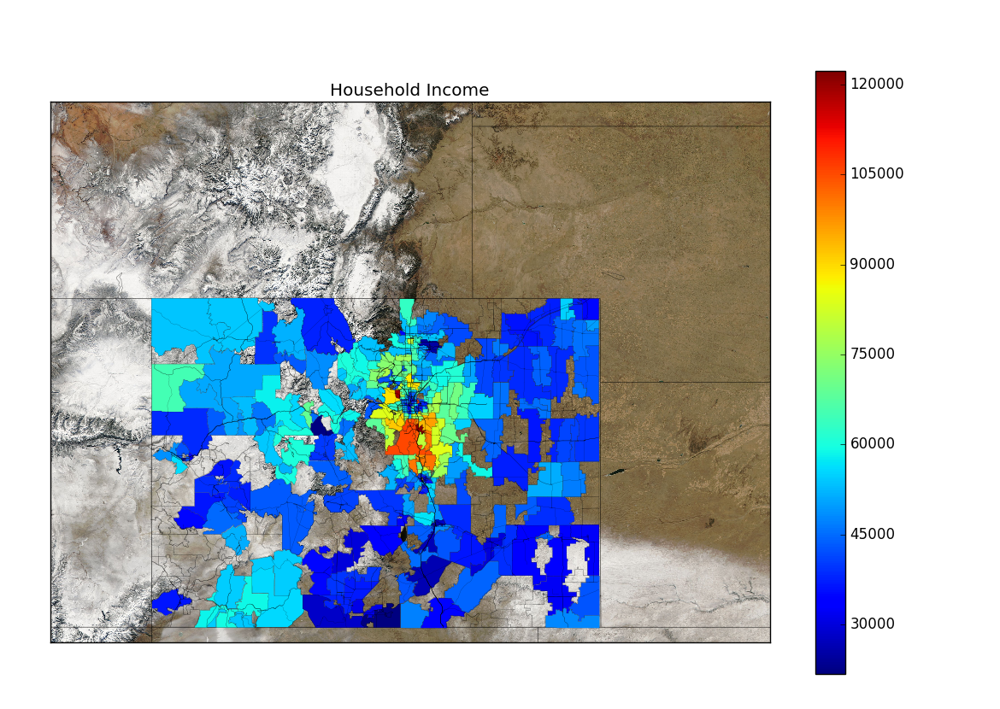

# choropleth
Generate [Choropleths](https://en.wikipedia.org/wiki/Choropleth_map) with Python3

## Required Python Modules
- numpy
- pandas
- matplotlib
- basemap
- shapefile

## Example Output
Overlaid satellite imagery, zip code boundaries (census shapefile), and roads (shapefile).

